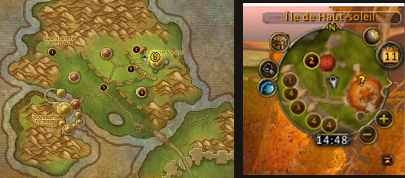

# mod-quest-radar

*[Read this in English](README.md)*

Module C++ pour **AzerothCore 3.3.5a** qui indique où se trouvent les
objectifs de vos quêtes en cours, dans l'esprit de QuestHelper / Questie —
avec un addon client ([`client-addon/QuestRadar/`](client-addon/QuestRadar))
qui les affiche sous forme d'icônes sur la **minimap**, ce que WotLK n'a
jamais fait nativement.

## Captures d'écran

| Une icône par objectif, numérotée par quête | Vue en jeu |
|---|---|
|  |  |

La quête 4 du suivi, *Les affaires de Solanian*, a trois objectifs à trois
endroits différents — la minimap porte donc trois icônes marquées `4`.



Même instant, mêmes quêtes : la carte du monde (à gauche) place **un seul**
cercle pour la quête 4, la minimap (à droite) montre ses trois objectifs
séparément. L'API client qu'utilise la carte du monde
(`QuestPOIGetIconInfo`) ne renvoie qu'une position par quête ; le module lit
les mêmes tables `quest_poi` sans cette limite.

## Les deux parties

1. **Le module serveur** (`src/`) lit les tables `quest_poi` /
   `quest_poi_points` et remonte les objectifs connus sur la carte du joueur,
   dans le chat (`.questradar`) ou via un pont addon (`CHAT_MSG_ADDON`).
2. **L'addon client** (`client-addon/QuestRadar/`) les dessine sur la
   minimap. Un module serveur ne peut pas toucher à l'UI du client, donc
   l'affichage doit vivre dans un addon.

L'addon livré **fonctionne sans le module** : il lit les données de POI que
le client possède déjà. Quand le module est présent, il le détecte et passe
à une icône par *objectif* au lieu d'une par quête. Voir
[`client-addon/README.md`](client-addon/README.md).

## Fonctionnalités

- Annonce dans le chat les objectifs connus les plus proches à l'acceptation
  d'une quête (`QuestRadar.AnnounceOnAccept`).
- Commande `.questradar` (alias `.qr`) : liste les objectifs les plus proches
  de chaque quête en cours sur la carte actuelle.
- Pont addon (`QuestRadar.AddonSyncEnabled`) : envoie la position du joueur
  et la liste complète des objectifs de la carte, pour l'affichage minimap.
- N'utilise que des données déjà chargées par le core
  (`ObjectMgr::GetQuestPOIVector`) : aucune nouvelle table, aucun import SQL.
- Aucune dépendance à Eluna ni à un autre module.

## Installation

### 1. Copier le module

```bash
cp -r mod-quest-radar/ <azerothcore>/modules/
```

Garder le dossier nommé **`mod-quest-radar`** — AzerothCore en dérive le nom
du point d'entrée `Addmod_quest_radarScripts()` (voir
`src/QuestRadarLoader.cpp`).

### 2. Compiler

```bash
cd <azerothcore>/build
cmake .. -DMODULES_FOLDER=../modules
make -j$(nproc)
```

### 3. Configurer

```bash
cp conf/mod-questradar.conf.dist <worldserver_dir>/mod-questradar.conf
```

### 4. Démarrer worldserver

Le module se charge automatiquement :
```
mod-questradar: Loaded - Enabled=1 AnnounceOnAccept=1 MaxObjectivesShown=3 AddonSyncEnabled=1
```

### 5. Installer l'addon client (optionnel, pour les icônes minimap)

```bash
cp -r mod-quest-radar/client-addon/QuestRadar/ <client_wow>/Interface/AddOns/
```

Tout ce dont il a besoin, Astrolabe compris, est fourni avec. Voir le
[README de l'addon](client-addon/QuestRadar/README.md) pour ses réglages et
ses commandes `/qr`.

## Configuration

| Option | Défaut | Effet |
|---|---|---|
| `QuestRadar.Enable` | `1` | Interrupteur général |
| `QuestRadar.AnnounceOnAccept` | `1` | Annonce les objectifs à l'acceptation d'une quête |
| `QuestRadar.MaxObjectivesShown` | `3` | Nombre max d'objectifs listés par annonce |
| `QuestRadar.AddonSyncEnabled` | `1` | Pont serveur↔addon utilisé pour les icônes minimap |

## Structure des fichiers

```
mod-quest-radar/
├── conf/
│   └── mod-questradar.conf.dist
├── src/
│   ├── QuestRadar.h           # config + structures + prototypes
│   ├── QuestRadar.cpp         # recherche des objectifs + formatage du protocole addon
│   └── QuestRadarLoader.cpp   # hooks, commande .questradar, pont addon
└── client-addon/              # voir client-addon/README.md
    ├── QuestRadar/            # addon livré (autonome, utilise le module s'il est là)
    └── server-module-variant/ # référence : l'addon d'origine, uniquement via le pont
```

## Hooks utilisés

| Hook | Quand | Action |
|---|---|---|
| `OnBeforeConfigLoad` | Démarrage / `.reload config` | Charge la config `.conf` |
| `OnPlayerQuestAccept` | Le joueur accepte une quête | Annonce les objectifs les plus proches |
| `OnPlayerBeforeSendChatMessage` | L'addon envoie une requête `REQ` | Répond avec les objectifs connus |
| `.questradar` / `.qr` | À la demande du joueur | Annonce les objectifs les plus proches |
