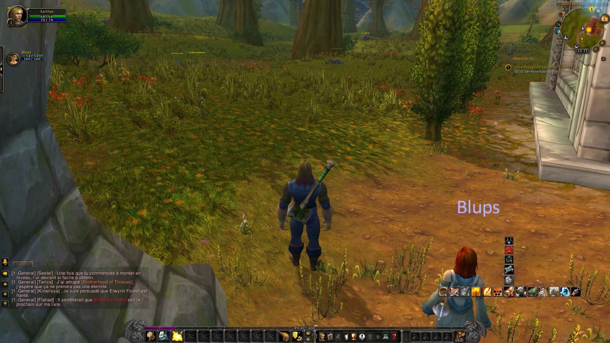

# mod-quest-radar

*[Lire en français](README.fr.md)*

Native C++ module for **AzerothCore 3.3.5a** that helps a player locate the
objectives of their current quests (area/coordinates), in the spirit of
QuestHelper / Questie — with, in addition to the server module, a
companion **client addon** that shows these objectives as icons on the
**minimap** (see [`client-addon/QuestRadar/`](client-addon/QuestRadar)).

## Screenshots

| Minimap icon (numbered objective + area) | In-game view |
|---|---|
|  |  |

## Why two parts (server module + client addon)

An AzerothCore C++ module runs **server-side**, inside `worldserver`. It
can't draw an icon on the 3.3.5a client's minimap: that's Blizzard UI/Lua
territory, which only a **client addon** can modify. QuestHelper and
Questie are themselves 100% client addons — and WotLK 3.3.5 has no native
equivalent at all (this feature came later, with Questie in particular).

This module therefore provides:

1. **The server module** (`src/`): computes, from data already present in
   the database (`quest_poi` / `quest_poi_points`), which quest objectives
   are known on the player's current map, and shows them in chat
   (`.questradar`) or via an **addon communication bridge**
   (`CHAT_MSG_ADDON` / `LANG_ADDON`) toward a client addon.
2. **The client addon** (`client-addon/QuestRadar/`): draws the objectives
   as icons on the minimap. The world map doesn't need to be handled: WotLK
   already draws quest POIs on it natively.

### The client addon no longer requires the module

The shipped addon in [`client-addon/QuestRadar/`](client-addon/QuestRadar)
now reads the quest POI data **the 3.3.5a client already has**
(`QuestMapUpdateAllQuests` / `QuestPOIUpdateIcons` / `QuestPOIGetIconInfo`)
and projects it onto the minimap with
[!Astrolabe](https://github.com/Trimitor/WDM-addons). It works on any
AzerothCore with a populated `quest_poi` table — **no server module, no
recompile**. Verified in-game.

The original bridge-based addon is preserved in
[`client-addon/server-module-variant/`](client-addon/server-module-variant).
It is kept because it still does something the client API cannot: 3.3.5a Lua
exposes only **one POI per quest**, while the module can provide **one group
per objective** plus the area circles. Wiring the two together — standalone
by default, per-objective when the module is detected — is the intended end
state and is not done yet. See
[`client-addon/README.md`](client-addon/README.md).

Note that both the module and the client read the **same** source: the
`quest_poi` / `quest_poi_points` tables. The module's original justification
— that the client cannot know its own position in yards, since `UnitPosition`
does not exist on 3.3.5a — no longer applies: !Astrolabe handles that
conversion.

## Features

- Automatically announces in chat, when a quest is accepted, the nearest
  known objectives (`QuestRadar.AnnounceOnAccept`).
- Manual `.questradar` command (alias `.qr`): lists the nearest objectives
  for every quest currently in progress on the current map.
- Relies only on data the core already loads
  (`ObjectMgr::GetQuestPOIVector`, `quest_poi` / `quest_poi_points` tables):
  no new table, no SQL import needed.
- A quest with no `quest_poi` data (common for lesser-documented classic
  quests) is silently skipped rather than showing a wrong position.
- Addon communication bridge (`QuestRadar.AddonSyncEnabled`): replies to
  the client addon's requests with the player's position and the full list
  (not just the top 3) of objectives known on the current map, for minimap
  display.

## Compatibility

- ✅ AzerothCore 3.3.5a (`master` branch, "modern" core API:
  `PlayerScript`/`WorldScript` hooks, `Acore::ChatCommands`)
- No dependency on Eluna or any other module.

## Installation

### 1. Copy the module

```bash
cp -r mod-quest-radar/ <azerothcore>/modules/
```

Keep the folder named **`mod-quest-radar`** (or, if you rename it, update
the `Addmod_quest_radarScripts()` function name in
`src/QuestRadarLoader.cpp` accordingly — see the comment in that file,
AzerothCore's build system derives this name from the folder's name).

### 2. Build

```bash
cd <azerothcore>/build
cmake .. -DMODULES_FOLDER=../modules
make -j$(nproc)
```

### 3. Configure

```bash
cp conf/mod-questradar.conf.dist <worldserver_dir>/mod-questradar.conf
```

### 4. Start worldserver

The module loads automatically. Check the logs:
```
mod-questradar: Loaded - Enabled=1 AnnounceOnAccept=1 MaxObjectivesShown=3 AddonSyncEnabled=1
```

### 5. Install the client addon (optional, for minimap icons)

Copy `client-addon/QuestRadar/` into `Interface/AddOns/` of the 3.3.5a WoW
client of every player who wants the icons (the server module alone keeps
working without it, via `.questradar`):

```bash
cp -r mod-quest-radar/client-addon/QuestRadar/ <client_wow>/Interface/AddOns/
```

It also needs **`!Astrolabe`** in the same `Interface/AddOns/`, enabled on
the addon selection screen — it is what converts a quest POI coordinate into
a minimap position. Available from
[Trimitor/WDM-addons](https://github.com/Trimitor/WDM-addons).

This addon does **not** need the server module: it reads the client's own
quest POI data. See the [addon's README](client-addon/QuestRadar/README.md),
and [`client-addon/README.md`](client-addon/README.md) for the difference
with the preserved bridge-based variant.

## File structure

```
mod-quest-radar/
├── conf/
│   └── mod-questradar.conf.dist
├── README.md
├── data/
│   └── sql/
│       └── db-world/          # reserved for a future evolution (empty for now)
├── src/
│   ├── QuestRadar.h           # config + structures + prototypes
│   ├── QuestRadar.cpp         # logic: finding objectives + formatting the addon protocol
│   └── QuestRadarLoader.cpp   # PlayerScript/WorldScript hooks, .questradar command, addon bridge
└── client-addon/              # see client-addon/README.md - only ONE of the two can be installed
    ├── QuestRadar/            # SHIPPED: standalone, reads the client's own quest POI data
    │   ├── QuestRadar.toc
    │   ├── QuestRadar.lua     # POI enumeration + minimap projection via !Astrolabe
    │   └── README.md
    └── server-module-variant/ # REFERENCE: gets its positions from this module instead
        ├── QuestRadar.toc
        ├── Core.lua           # addon protocol (sending REQ, receiving ME/OBJ/END), settings
        ├── Minimap.lua        # minimap icons + areas (player/objective delta)
        ├── Options.lua        # native options panel (Esc > Interface > AddOns)
        └── Icons/             # glow.blp (vendored image, see Icons/README.md)
```

## Hooks used

| Hook | When | Action |
|---|---|---|
| `OnBeforeConfigLoad` | Startup / `.reload config` | Loads the `.conf` config |
| `OnPlayerQuestAccept` | The player accepts a quest | Announces the nearest objectives (if enabled) |
| `OnPlayerBeforeSendChatMessage` | The client addon self-whispers a `REQ` request | Replies with the known objectives (addon bridge) |
| `.questradar` / `.qr` command | On the player's request | Announces the nearest objectives |

## Roadmap

Minimap display (addon + communication bridge), filtering by tracked
quests, and an options panel are now implemented — see
[`client-addon/QuestRadar/`](client-addon/QuestRadar). Remaining, not yet
implemented, improvement ideas:

- Configurable icon size/color (currently hardcoded in `Minimap.lua`).
